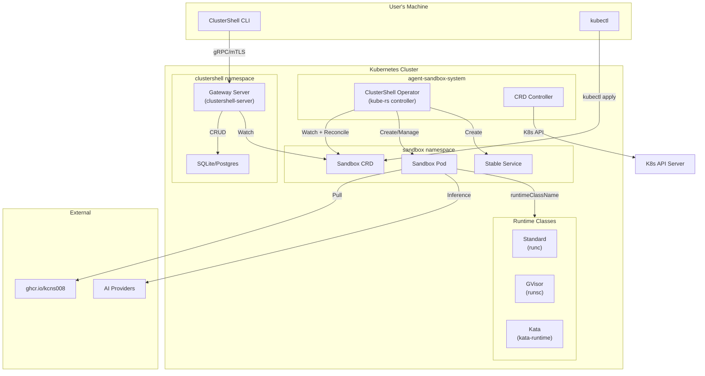
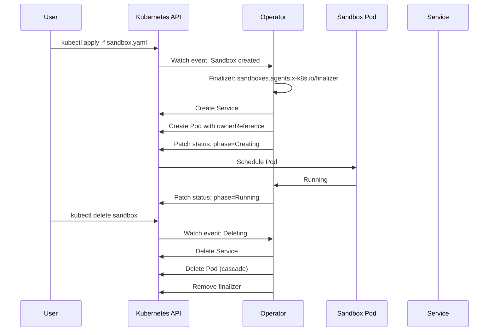
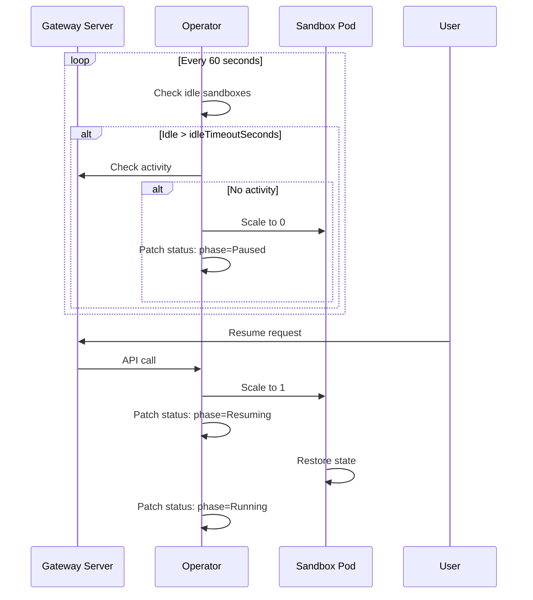
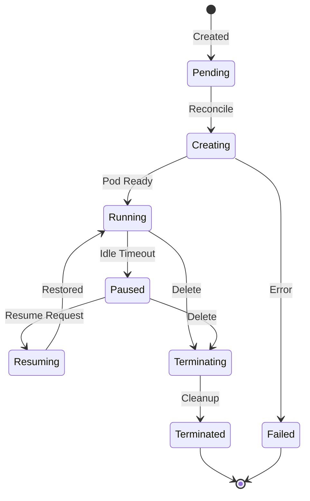
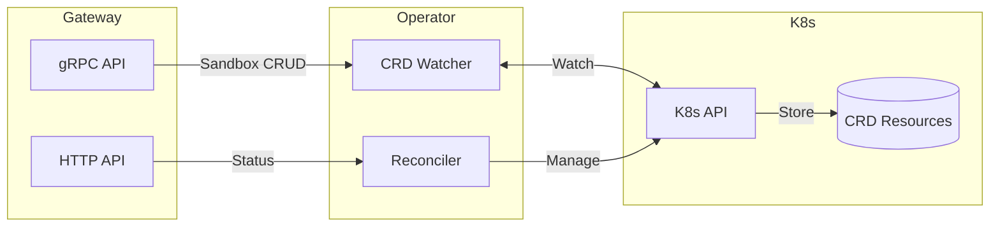

# Kubernetes Operator Architecture

## Overview

The ClusterShell Kubernetes Operator provides native integration with Kubernetes and OpenShift clusters, implementing the [kubernetes-sigs/agent-sandbox](https://github.com/kubernetes-sigs/agent-sandbox) specification for managing singleton, stateful AI agent workloads.

The operator follows a **hybrid architecture** that coexists with ClusterShell's existing sandbox runtime:
- **Traditional Mode**: Direct process sandboxing with Landlock/seccomp/network namespaces
- **Kubernetes Mode**: CRD-based sandbox management with the operator
- **Hybrid Mode**: Both modes available, chosen at deployment time

## Design Principles

1. **API Compatibility**: Implements the agent-sandbox Sandbox CRD specification
2. **Stable Identity**: Each Sandbox gets a stable hostname and network identity
3. **Strong Isolation**: Support for gVisor and Kata Containers runtimes
4. **Lifecycle Management**: Scale-to-zero, hibernation, and warm pools
5. **OpenShift Native**: Routes, Security Context Constraints, and integrated auth

## Architecture



## CRD Resources

The operator manages four Custom Resource Definitions:

### 1. Sandbox CRD

The core resource representing a singleton, stateful AI agent workload.

```yaml
apiVersion: agents.x-k8s.io/v1alpha1
kind: Sandbox
metadata:
  name: my-agent
  namespace: default
spec:
  podTemplate:
    spec:
      containers:
      - name: sandbox
        image: ghcr.io/kcns008/clustershell-community/sandboxes/base:latest
        resources:
          limits:
            memory: "4Gi"
            cpu: "2"
  runtimeClass: GVisor  # Standard, GVisor, or Kata
  hibernationEnabled: true
  idleTimeoutSeconds: 3600
  lifecycle:
    shutdownPolicy: Retain
```

**Key Features:**
- `runtimeClass`: Choose isolation level (Standard, GVisor, Kata)
- `hibernationEnabled`: Enable scale-to-zero when idle
- `idleTimeoutSeconds`: Auto-hibernate after inactivity
- `lifecycle.shutdownPolicy`: Delete or Retain on expiry
- `replicas`: Only 0 or 1 allowed (singleton constraint)

### 2. SandboxTemplate CRD

Reusable templates for creating sandboxes with predefined configurations.

```yaml
apiVersion: agents.x-k8s.io/v1alpha1
kind: SandboxTemplate
metadata:
  name: claude-template
spec:
  template:
    spec:
      containers:
      - name: sandbox
        image: ghcr.io/kcns008/clustershell-community/sandboxes/base:latest
        env:
        - name: ANTHROPIC_API_KEY
          valueFrom:
            secretKeyRef:
              name: anthropic-credentials
              key: api-key
  defaultRuntimeClass: GVisor
  defaultHibernationEnabled: true
```

### 3. SandboxClaim CRD

Abstraction for requesting a sandbox from a template.

```yaml
apiVersion: agents.x-k8s.io/v1alpha1
kind: SandboxClaim
metadata:
  name: my-claim
spec:
  templateRef: claude-template
  sandboxNamePrefix: agent-
  overrides:
    hibernationEnabled: false
```

### 4. SandboxWarmPool CRD

Pre-warmed sandbox pools for fast allocation.

```yaml
apiVersion: agents.x-k8s.io/v1alpha1
kind: SandboxWarmPool
metadata:
  name: agent-pool
spec:
  templateRef: claude-template
  minReady: 2
  maxSize: 10
  scaleDownDelaySeconds: 300
```

## Controller Reconciliation

The operator implements Kubernetes controller patterns:

### Sandbox Controller



### Hibernation Controller



## Isolation Runtimes

The operator supports three isolation levels through Kubernetes RuntimeClasses:

### Standard (runc)
- Traditional Linux container isolation
- Namespaces, cgroups, seccomp
- **Use case**: Trusted workloads, development

### GVisor (runsc)
- Userspace kernel for container isolation
- System call interception and filtering
- **Use case**: Untrusted code execution
- **Setup**: Requires gVisor runtime installed on nodes

### Kata Containers (kata-runtime)
- VM-level isolation per container
- Lightweight VMs with their own kernel
- **Use case**: Strong multi-tenant isolation
- **Setup**: Requires Kata runtime installed on nodes

```yaml
apiVersion: node.k8s.io/v1
kind: RuntimeClass
metadata:
  name: gvisor
handler: runsc
scheduling:
  nodeSelector:
    runtime: gvisor
```

## OpenShift Integration

### Routes

OpenShift Routes provide external access to sandboxes:

```yaml
apiVersion: route.openshift.io/v1
kind: Route
metadata:
  name: my-sandbox
spec:
  host: my-sandbox.apps.cluster.example.com
  to:
    kind: Service
    name: my-sandbox
  port:
    targetPort: http
  tls:
    termination: edge
```

### Security Context Constraints

Custom SCCs for sandbox isolation:

```yaml
apiVersion: security.openshift.io/v1
kind: SecurityContextConstraints
metadata:
  name: clustershell-sandbox
allowPrivilegedContainer: false
requiredDropCapabilities:
  - ALL
allowedCapabilities:
  - NET_ADMIN
  - SYS_ADMIN
runAsUser:
  type: MustRunAsNonRoot
seLinuxContext:
  type: MustRunAs
seccompProfiles:
  - runtime/default
```

## Lifecycle States



| Phase | Description |
|-------|-------------|
| `Pending` | Sandbox created, awaiting reconciliation |
| `Creating` | Pod and Service being provisioned |
| `Running` | Sandbox active and ready |
| `Paused` | Hibernated (scale to zero) |
| `Resuming` | Restoring from hibernation |
| `Terminating` | Cleanup in progress |
| `Terminated` | Resources deleted |
| `Expired` | Shutdown time reached |
| `Failed` | Creation or runtime error |

## Hybrid Mode Deployment

### Mode Selection

```yaml
# values.yaml
operator:
  enabled: true  # Enable Kubernetes operator
  
sandbox:
  mode: hybrid   # Options: native, kubernetes, hybrid
```

### Native Mode (Default)
- Sandboxes run via direct process isolation
- No Kubernetes dependency
- Best for local development

### Kubernetes Mode
- All sandboxes managed via CRDs
- Full Kubernetes lifecycle
- Best for production clusters

### Hybrid Mode
- Existing sandboxes continue with native isolation
- New sandboxes can use CRD-based management
- Gateway coordinates between both modes
- Best for migration scenarios

## Network Architecture

### Stable Identity

Each Sandbox receives:
- **Service**: `{sandbox-name}`
- **FQDN**: `{sandbox-name}.{namespace}.svc.cluster.local`
- **Headless Service**: Optional for direct pod access

### Multi-Agent Communication

```yaml
apiVersion: agents.x-k8s.io/v1alpha1
kind: Sandbox
metadata:
  name: agent-a
spec:
  podTemplate:
    spec:
      containers:
      - name: sandbox
        env:
        - name: AGENT_B_HOST
          value: agent-b.default.svc.cluster.local
```

## Storage

### Persistent Volume Claims

```yaml
apiVersion: agents.x-k8s.io/v1alpha1
kind: Sandbox
spec:
  volumeClaimTemplates:
  - metadata:
      name: workspace
    spec:
      accessModes:
      - ReadWriteOnce
      resources:
        requests:
          storage: 10Gi
```

### State Preservation

Hibernation preserves:
- Container filesystem (via PVC)
- Environment variables
- Network identity (Service persists)
- **Not preserved**: Ephemeral storage, running processes

## Integration with Gateway

The operator integrates with the existing ClusterShell gateway:



## Deployment

### Helm Installation

```bash
# Enable operator
helm install clustershell deploy/helm/clustershell \
  --set operator.enabled=true \
  --set openshift.enabled=true \
  --set runtimeClasses.enabled=true
```

### Verification

```bash
# Check CRDs
kubectl get crd | grep agents.x-k8s.io

# Check operator
kubectl get pods -n agent-sandbox-system

# Create test sandbox
kubectl apply -f - <<EOF
apiVersion: agents.x-k8s.io/v1alpha1
kind: Sandbox
metadata:
  name: test-sandbox
spec:
  podTemplate:
    spec:
      containers:
      - name: sandbox
        image: ghcr.io/kcns008/clustershell-community/sandboxes/base:latest
EOF

# Check status
kubectl get sandbox test-sandbox -o yaml
```

## Migration from Native Mode

1. **Deploy Operator**: Install with operator enabled
2. **CRD Registration**: Apply CRD manifests
3. **Parallel Operation**: Both modes work simultaneously
4. **Gradual Migration**: Recreate sandboxes via CRDs
5. **Native Deprecation**: Disable native mode when ready

## Security Considerations

1. **RBAC**: Operator requires permissions to manage:
   - Pods, Services, PVCs
   - Sandbox CRDs
   - Events

2. **Network Policies**: Sandboxes isolated by default

3. **Runtime Security**: Strong isolation via gVisor/Kata

4. **Secrets**: Provider credentials via Kubernetes Secrets

5. **Audit**: All CRD operations logged

## See Also

- [Sandbox Architecture](sandbox.md) - Traditional sandbox runtime
- [Gateway Architecture](gateway.md) - Control plane
- [System Architecture](system-architecture.md) - High-level overview
- [OpenShift Routes](gateway-deploy-connect.md) - External access
